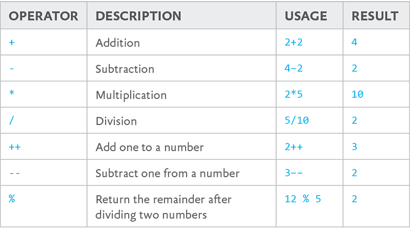

# Leap year

## Instructions

Determine whether any given year is a leap year or not.

A leap year, according to the Gregorian calendar, occurs:

- on every year that is evenly divisible by 4
- unless that year that is a new century (evenly divisible by 100)
- unless the century is divisible by 400

*For example*, 1997 is not a leap year, but 1996 is. 1900 is not a leap year, but 2000 is.

For a full rundown on leap years, check out this [video](https://www.youtube.com/watch?v=xX96xng7sAE)

These math operators may prove useful to you (hint, hint. wink, wink. nudge, nudge).

## Bonus Round

Get Javascript to get the year from the computer and evaluate whether it a leap year or not. 

Show the results in the HTML.

## Test Data

**Leapyears**

- 2016
- 2000
- 1992
- 2400

**NOT leap years**

- 2015
- 1900
- 1978
- 2100

## The Code

	<!DOCTYPE html>
	<html lang="en">
	<head>
	    <meta charset="UTF-8">
	    <meta name="viewport" content="width=device-width, minimum-scale=1.0">

	    <title>Leap Year</title>

	</head>
	<body>
		<h1>Is this year a leap year?</h1>
		

		
	</body>
	</html>

